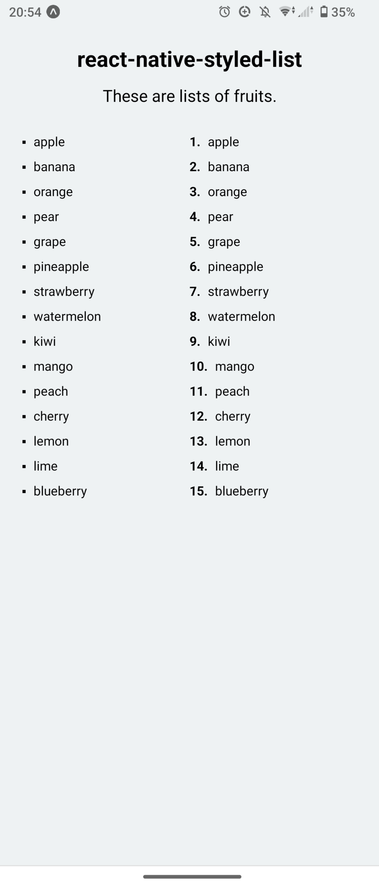

# react-native-styled-list

react native styled list

<p align="center">
  
</p>

## Installation

```sh
# npm
npm install react-native-styled-list

# yarn
yarn add react-native-styled-list
```

## Usage

### `BulletedList`

```jsx
import React from "react";
import { View, Text } from "react-native";
import { BulletedList } from "react-native-styled-list";

export default function App() {
  return (
    <View>
      <BulletedList>
        <Text>apple</Text>
        <Text>banana</Text>
        <Text>orange</Text>
      </BulletedList>
    </View>
  );
}
```

### `NumberedList`

```jsx
import React from "react";
import { View, Text } from "react-native";
import { NumberedList } from "react-native-styled-list";

export default function App() {
  return (
    <View>
      <NumberedList>
        <Text>apple</Text>
        <Text>banana</Text>
        <Text>orange</Text>
      </NumberedList>
    </View>
  );
}
```

## Contributing

See the [contributing guide](CONTRIBUTING.md) to learn how to contribute to the repository and the development workflow.

## License

MIT

---

Made with [create-react-native-library](https://github.com/callstack/react-native-builder-bob)
